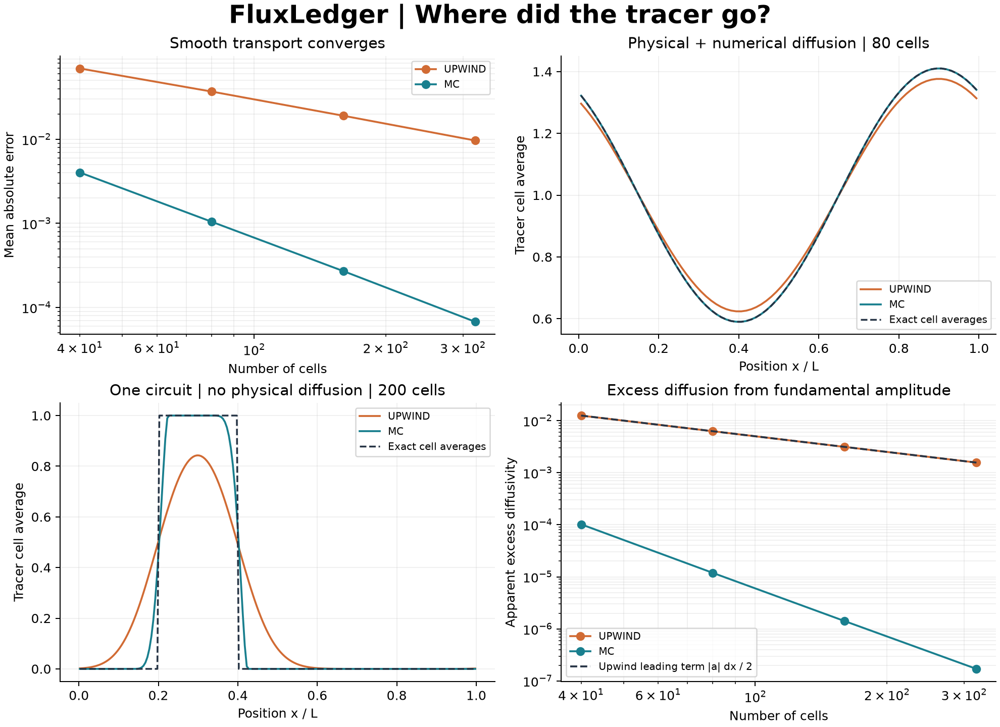

# FluxLedger

**Separate physical mixing from numerical smearing.** A C++17/Python finite-volume
laboratory transports a tracer around a periodic ring, compares upwind and MUSCL
reconstruction, and audits conservation, boundedness, accuracy, and apparent
diffusion against analytical solutions.



At 200 cells after one circuit with zero physical diffusion, the pulse's mean
absolute error is **0.112592 with upwind and 0.023262 with MC**. Both conserve
mass to floating-point precision, so mass balance alone cannot reveal the
smearing. MC achieves approximately second-order convergence for the supplied
smooth-wave experiments. These are measured results, not universal accuracy claims.

## Install and run

Requires Python 3.11+, a C++17 compiler, CMake 3.20+, and internet access for
initial build dependencies. On Windows, install Visual Studio Build Tools with
Desktop development with C++; on Linux, GCC or Clang. The isolated Python build
obtains CMake if needed. There is no pure-Python solver fallback or prebuilt wheel
distribution service.

```sh
git clone https://github.com/racostacme-come/fluxledger.git
cd fluxledger
python -m venv .venv
# Linux/macOS: source .venv/bin/activate
# PowerShell: .\.venv\Scripts\Activate.ps1
python -m pip install ".[dev]"
fluxledger campaign --output out/campaign
python examples/one_circuit.py
```

`campaign` writes three CSV files, `validation.json`, and a four-panel PNG,
and exits nonzero if analytical gates fail. Existing files with these names
in the selected output directory are replaced. See the
[validation record](docs/validation.md) and [sample report](results/validation.json).

```sh
fluxledger run --profile sine --cells 160 --velocity -0.7 --diffusivity 0.01 --duration 0.5 --scheme mc --output out/custom
fluxledger run --profile pulse --diffusivity 0 --duration 1 --scheme upwind --output out/pulse
fluxledger --help
```

The sine starts at `1 + 0.5 sin(2 pi x/L)`; the unit pulse occupies `[0.2L, 0.4L]`.
`solution.csv` contains position and initial/final averages; `ledger.json`
records parameters, step count/size, and mass balance.

## Governing equation and method

For constant velocity $a$, diffusivity $\nu\ge0$, and ring length $L>0$:

$$\partial_tu+\partial_x(au-\nu\partial_xu)=0,\qquad u(x+L,t)=u(x,t).$$

The unknown $\bar u_i$ is a **cell average**, with $\Delta x=L/N$ and
$x_i=(i+1/2)\Delta x$. Each interface flux is computed once and shared:

$$\frac{d\bar u_i}{dt}=R_i(\bar u)=-\frac{F_{i+1/2}-F_{i-1/2}}{\Delta x},
\qquad F_{i+1/2}=a u^{\mathrm{up}}_{i+1/2}-\nu\frac{\bar u_{i+1}-\bar u_i}{\Delta x}.$$

Upwind uses zero slopes. MC (monotonized central) uses

$$s_i=\operatorname{minmod}\left(2\delta_i^-,\frac{\delta_i^-+\delta_i^+}{2},2\delta_i^+\right),
\quad\delta_i^-=\bar u_i-\bar u_{i-1},\quad\delta_i^+=\bar u_{i+1}-\bar u_i.$$

Minmod returns the smallest magnitude with the common sign, or zero when signs
disagree. The left/right states at face $i+1/2$ are $\bar u_i+s_i/2$ and
$\bar u_{i+1}-s_{i+1}/2$; the sign of $a$ selects the upstream state.
Reconstruction is recomputed at every stage. Diffusion uses centered differences.

SSPRK(3,3) advances the system:

$$u^{(1)}=u^n+\Delta tR(u^n),$$
$$u^{(2)}=\tfrac34u^n+\tfrac14[u^{(1)}+\Delta tR(u^{(1)})],$$
$$u^{n+1}=\tfrac13u^n+\tfrac23[u^{(2)}+\Delta tR(u^{(2)})].$$

Both schemes use the conservative bound

$$\Delta t_{\max}=\frac{c}{2|a|/\Delta x+2\nu/\Delta x^2},\qquad0<c\le1.$$

`cfl` means $c$, a fraction of the **combined** bound, not $a\Delta t/\Delta x$.
The solver chooses $n_s=\lceil T/\Delta t_{\max}\rceil$ equal steps of size
$T/n_s$, landing on the requested final time. Zero transport or zero duration
returns an independent copy with zero steps. The default budget is one million
steps; requests exceeding it fail before integration.

The MC advective forward-Euler update can be written as a one-sided difference
with a coefficient between zero and $2|a|\Delta t/\Delta x$. Diffusion adds
$\nu\Delta t/\Delta x^2$ in each direction. This bound makes the update a convex
combination, giving boundedness and TVD for this scalar, uniform, periodic
problem; SSPRK3 preserves these properties in exact arithmetic. Roundoff
requires tolerances. Telescoping face fluxes conserve $M=\Delta x\sum_i\bar u_i$.

## Python and native APIs

```python
from fluxledger import fourier_average, solve

initial = fourier_average(160, length=1.0, mode=1)
result = solve(
    initial, velocity=-0.7, diffusivity=0.01, length=1.0, duration=0.5, scheme="mc", cfl=0.8
)
print(result.steps, result.dt, result.mass_drift)
exact = fourier_average(160, velocity=-0.7, diffusivity=0.01, time=0.5)
```

`solve(initial, *, velocity=1, diffusivity=0, length=1, duration=1,
cfl=0.8, scheme="mc", max_steps=1_000_000)` accepts a finite real 1D array
with at least four cells and does not mutate it. `Result` exposes `centers`,
`values`, `duration`, `steps`, `dt`, `initial_mass`, `final_mass`, and `mass_drift`.
Its owned arrays are writable; mass fields are snapshots at return time.
Invalid inputs raise `ValueError` (type/integer conversion can raise `TypeError`);
arithmetic overflow raises `OverflowError`.

`fourier_average` supports positive integer modes below Nyquist.
`top_hat_average` computes exact overlap averages, including cut cells.
Use consistent units: velocity is length/time, diffusivity is length squared/time.
The supplied examples are nondimensional.

The header-only C++ API in `cpp/transport.hpp` needs no Python dependency:

```cpp
#include "transport.hpp"
auto result = fluxledger::solve(std::vector<double>{0, 1, 1, 0},
    1.0, 0.01, 1.0, 0.5, 0.8, fluxledger::Scheme::mc);
```

The binding copies input before releasing the GIL and returns an owned NumPy
array. Scratch arrays are allocated once: memory $O(N)$, work $O(Nn_s)$.
There is no shared mutable solver state.

## Validation and reproducibility

The smooth reference is integrated over each cell:

$$\bar u_i(t)=1+\frac12\operatorname{sinc}(m/N)e^{-\nu k^2t}\sin(k(x_i-at)),
\qquad k=2\pi m/L,$$

with $\operatorname{sinc}(z)=\sin(\pi z)/(\pi z)$. Comparing against point values
would contaminate a second-order error study. Errors are
$N^{-1}\sum_i|\bar u_i-\bar u_i^{\mathrm{exact}}|$; orders are $\log_2(e_N/e_{2N})$.

From fundamental Fourier amplitude $A_1$, the diagnostic
$\nu_{\mathrm{eff}}=-\log(|A_1(T)/A_1(0)|)/(k^2T)$ measures attenuation;
excess diffusion is $\nu_{\mathrm{eff}}-\nu$. Upwind's leading semidiscrete
small-wavenumber excess is $|a|\Delta x/2$. MC creates harmonics: this diagnostic
is **mode- and experiment-dependent**, not a material property or phase-error
measure. It can be negative for some diffusion discretizations. The figure's
attenuation panel uses pure advection.

```sh
ruff check .
ruff format --check .
clang-format --dry-run --Werror cpp/transport.hpp cpp/bindings.cpp cpp/test_transport.cpp
python -m pytest --cov=fluxledger --cov-report=term-missing
cmake -S . -B build/native -DFLUXLEDGER_PYTHON=OFF
cmake --build build/native --config Release
ctest --test-dir build/native -C Release --output-on-failure
python -m build
python -m pip check
```

CTest uses explicit failures so checks stay active in Release. CI runs on
Ubuntu/Windows with Python 3.11/3.14, builds the source distribution and its
wheel, and uploads numerical outputs. `requirements-repro.txt` captures the
local Windows/Python 3.14 runtime/dev versions, plus build backend pins.
It is an environment snapshot, not a cross-version lockfile. For the same
environment, install it before `python -m pip install --no-build-isolation .`.

## Limitations

- One-dimensional, uniform, periodic mesh; constant coefficients and linear
  scalar transport. No walls, inflow/outflow, sources, nonuniform meshes,
  compressible systems, or turbulence model.
- Explicit diffusion requires $O(\Delta x^2)$ time steps. This is a verification
  laboratory, not a large-scale CFD solver; no parallel mesh decomposition.
- Limiting reduces local accuracy at extrema and discontinuities. Smooth
  global L1 convergence does not guarantee pointwise second order everywhere.
- CSV last digits and PNG fonts may differ across compilers/OSes. Numerical
  checks use tolerances; bitwise reproducibility is not promised.
- Extreme dimensional parameters and long integrations are not certified.
  Nondimensionalize inputs; finite checks do not prove conditioning.
- Python coverage excludes native branch coverage. Consult actual
  [CI runs](https://github.com/racostacme-come/fluxledger/actions) for remote
  results; a workflow file is not evidence of a passing run.

## Provenance and references

Original implementation inspired by local CFD topics in numerical approximation,
time integration, scheme analysis, and unsteady 1D advection-diffusion. Only
folder/file names were used to select the topic. No course text, solutions,
exercise code, private data, or exams were opened or copied. All data are synthetic.

- S. Gottlieb, C.-W. Shu, E. Tadmor (2001), *Strong Stability-Preserving
  High-Order Time Discretization Methods*, SIAM Review 43(1), 89-112:
  [author-hosted paper](https://math.umd.edu/~tadmor/pub/linear-stability/Gottlieb-Shu-Tadmor.SIREV-01.pdf),
  [DOI](https://doi.org/10.1137/S003614450036757X). Basis for SSP integration.
- [Clawpack limiter documentation](https://www.clawpack.org/v5.9.x/pyclaw/evolve/limiters.html):
  standard minmod and MC definitions. FluxLedger does not depend on or reproduce
  Clawpack's implementation.

MIT licensed; see [LICENSE](LICENSE). Development used an AI coding assistant
under the owner's direction. Git records the configured author and actual
commits; it does not imply independent human review.
